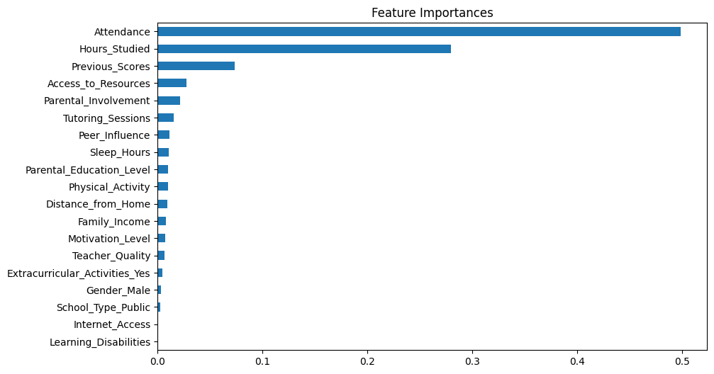
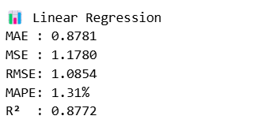
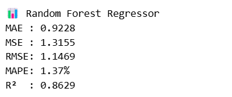
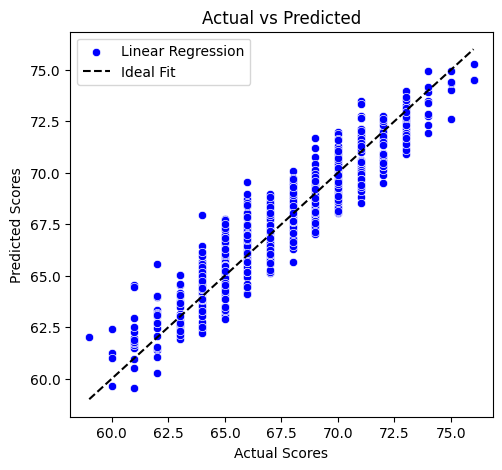
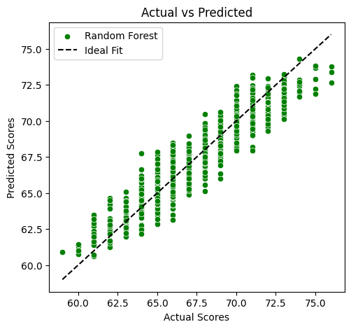
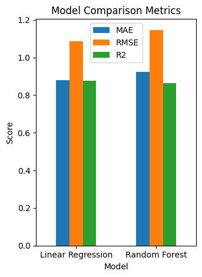

# 🎓 Student Performance Analysis & Exam Score Prediction

This project involves **Exploratory Data Analysis (EDA)** and building machine learning models to predict students' **exam scores** based on various academic, demographic, and lifestyle features.

---

## 📌 Dataset

- **Link**: https://www.kaggle.com/datasets/lainguyn123/student-performance-factors
- **Description**: Contains various factors (numerical and categorical) affecting student performance.
- **Target Variable**: `Exam_Score`

---

## 🔍 Key Features

### 🧮 Numerical Features
- `Hours_Studied`
- `Attendance`
- `Sleep_Hours`
- `Previous_Scores`
- `Tutoring_Sessions`
- `Physical_Activity`

### 🧠 Categorical Features
- `Parental_Involvement`
- `Access_to_Resources`
- `Extracurricular_Activities`
- `Motivation_Level`
- `Internet_Access`
- `Family_Income`
- `Teacher_Quality`
- `School_Type`
- `Peer_Influence`
- `Learning_Disabilities`
- `Gender`
- `Distance_from_Home`
- `Parental_Education_Level`

---

## 📊 Exploratory Data Analysis (EDA)

- Missing values handled via `dropna()`
- Duplicate records removed
- Histogram and boxplot visualizations for all numerical features
- Countplots for all categorical variables
- Correlation matrix heatmap
- Scatter plots with `Exam_Score` to explore relationships

---

## 🔧 Preprocessing

- **Log Transformation**: `Tutoring_Sessions` for skew reduction
- **Min-Max Scaling**: All numerical features
- **Label Encoding**: Ordinal categorical features
- **One-Hot Encoding**: Nominal categorical features like `Gender`, `School_Type`, etc.
- **Outlier Removal**: Using Interquartile Range (IQR) method

---

## 🧠 Models Used

Two regression models were implemented:

- **Linear Regression**
- **Random Forest Regressor**

---

## 📈 Feature Importance

Feature importances from Random Forest:

---

## 📊 Model Evaluation Metrics
Linear Regression Evaluation:

Random Forest Evaluation:

---

## 📉 Visualization & Comparisons Between Models

### 🔵 Linear Regression: Actual vs Predicted

### 🟢 Random Forest: Actual vs Predicted

### 📊 Metric Comparison

---

## 🛠️ How to Run
-Use the Dataset uploaded in the repository
-Use and Run the model.ipynb file uploaded in the repository

